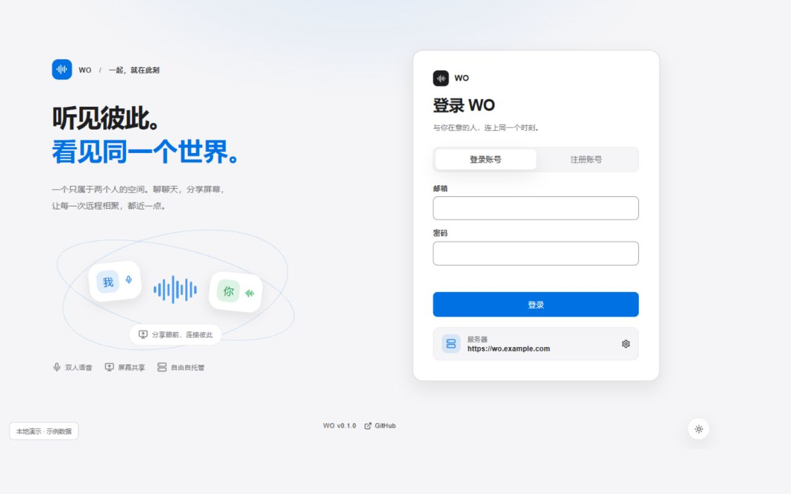
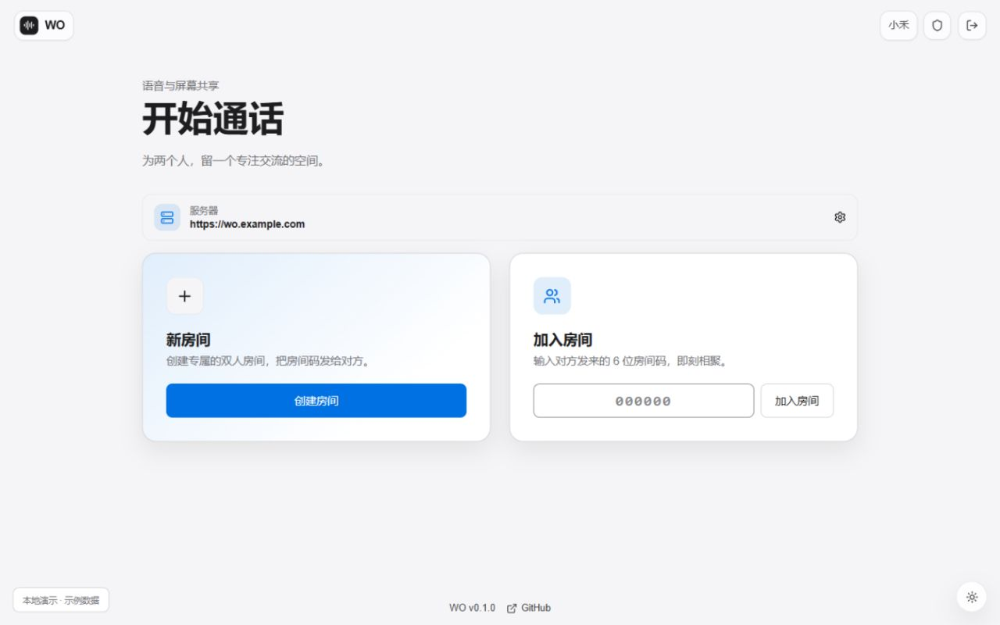
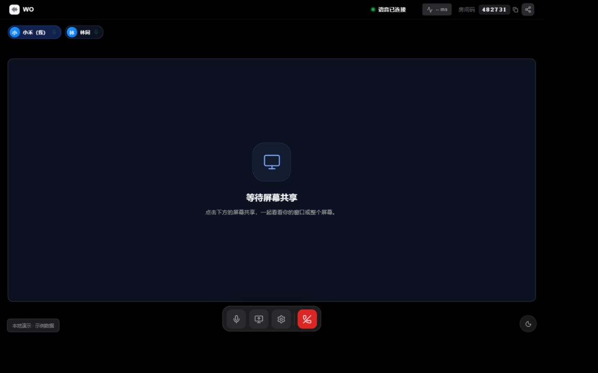
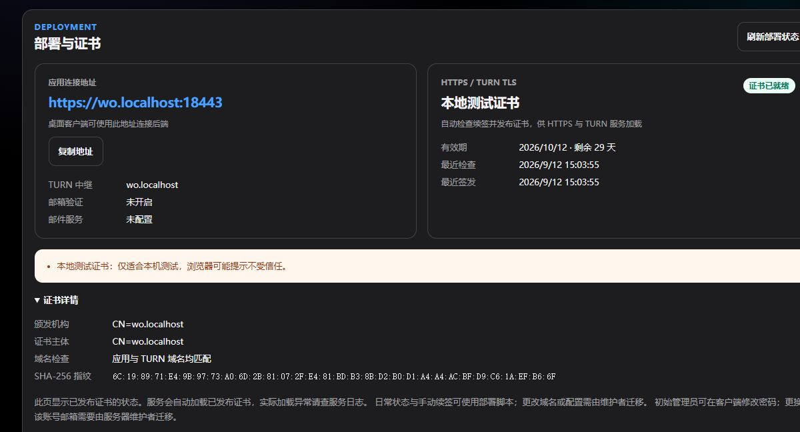

# WO

**English** | [简体中文](README.zh-CN.md)

**Hear each other. Share what is in front of you.**

WO is a self-hostable two-person voice and desktop-sharing application. In
server mode, your own Docker Compose stack provides accounts, room signaling,
the web client, PostgreSQL, and TURN, while media flows directly between the
two peers whenever the network allows. The desktop app additionally offers a
lightweight room mode restricted to trusted local networks.

[Desktop releases](https://github.com/kiritoko1029/WO/releases) ·
[Deployment guide](docs/deployment.md) ·
[Support matrix](docs/support-matrix.md)



## What you can do

- **Meet in one room.** Create a room, share its six-digit code or invite link,
  and bring one other person in.
- **Make the conversation comfortable.** Select your microphone and speakers,
  adjust input and output volume, mute, and choose supported noise suppression.
- **Share a screen or a window.** Keep voice and screen sharing together, with
  fullscreen viewing, zoom, and quality diagnostics. Capture and system audio
  availability depend on the platform; see the support matrix.
- **Choose where it runs.** Use a self-hosted server from the desktop or web
  client, or start a desktop-only room on a trusted local network.
- **Make it yours.** Follow the system theme or choose light/dark. Forms show
  the active operation, prevent duplicate submissions, and keep recovery actions
  available when a request fails. Modal dialogs support keyboard navigation.

## Screenshots

| A room starts with an invitation                                         | A focused space for two                                                                                     |
| ------------------------------------------------------------------------ | ----------------------------------------------------------------------------------------------------------- |
|  |  |

These are actual screenshots of the shared React interface, rendered with
local sample accounts and a simulated connected room. They demonstrate the UI;
the room image shows the screen-sharing waiting state. They are not a live
media benchmark or certification evidence. See the
[preview and capture instructions](docs/ui-preview.md) to reproduce them.

## Choose a connection mode

|                | Self-hosted server                              | Trusted-LAN lite                         |
| -------------- | ----------------------------------------------- | ---------------------------------------- |
| Clients        | Desktop + web                                   | Two desktop clients                      |
| Where it works | Across networks, with configured HTTPS and TURN | Same trusted private network             |
| Accounts       | Email-based accounts on your server             | Display name, no central account         |
| Invite         | Six-digit code or link                          | Full private client invite link required |
| Infrastructure | Docker Compose, PostgreSQL and TURN             | Temporary service on the host's desktop  |
| Lifetime       | Ends when the creator ends/leaves the room      | Also ends when the host sleeps or quits  |

> Current capabilities are covered by automated tests, but official
> Windows/macOS installers, real two-device LAN validation, and 1080p60 have
> not yet completed release certification. For the exact status see the
> [support matrix](docs/support-matrix.md).

## Repository layout

| Path                    | Purpose                                                      |
| ----------------------- | ------------------------------------------------------------ |
| `apps/desktop`          | Electron desktop client                                      |
| `apps/web`              | Browser client reusing the desktop React/WebRTC layers       |
| `apps/server`           | Central API, room signaling, and the embeddable LAN service  |
| `packages/protocol`     | Shared runtime protocol for REST, signaling, invites, WebRTC |
| `packages/database`     | PostgreSQL schema and migrations                             |
| `packages/config`       | Central service configuration                                |
| `packages/media-policy` | Media parameters and policies                                |
| `deploy`                | Compose deployment for Caddy, server, PostgreSQL, and coturn |
| `apps/media-lab-*`      | Media capability experiments, not part of the product entry  |

## Server-mode quick start

Requires Linux x86_64, Git, Docker Engine 26+ and Docker Compose 2.24.4+.
Point a domain's DNS A record at the server and open the documented HTTPS/TURN ports.
From the cloned repository, run:

```bash
bash deploy.sh
```

Enter the domain, ACME contact email, initial administrator email, public IPv4
and a password (or let the wizard generate one). The wizard generates config
and secrets, bootstraps the administrator, obtains a certificate through ACME,
and starts all five services. Host Node.js/pnpm are not required. Certificates
renew automatically and are reloaded by Caddy and TURN.

For an isolated Windows Docker Desktop trial:

```powershell
.\deploy.cmd --local
```

Local mode uses `https://wo.localhost:18443` and local test certificates.
Production uses `https://<your-domain>`. Open `/admin` for user management and
certificate status; the private first-login receipt is under
`deploy/.managed/<project>/first-login.txt` (`wo` for production, `wo-local` for local mode).
Rerunning `up` preserves the existing version and credentials; `status`, `logs`,
`renew` and `stop` are available too.

See the [guided deployment instructions](docs/quick-deploy.md) for ports, local
certificate trust, first login and troubleshooting. The
[advanced deployment guide](docs/deployment.md) retains manual configuration,
external ingress/database, backup and release workflows.



The admin capture uses the actual local Docker API and a local test certificate.

## Connecting the desktop app to your server

The desktop client shows a "Server" field on both the login page and the home
screen. The value must be a canonical HTTPS origin:

```text
https://wo.example.com
```

No path, query, fragment, username, or password is allowed. After saving, the
client restarts so that REST, WSS, CSP, and sessions all switch to the same
origin.

Backend resolution order:

```text
WO_API_ORIGIN > desktop user configuration > https://localhost
```

For example, an operator can pin the address:

```bash
WO_API_ORIGIN=https://wo.example.com pnpm --filter @wo/desktop dev
```

When `WO_API_ORIGIN` is set, the field becomes read-only. Refresh tokens are
bound to the origin, so switching servers never sends old credentials to the
new server. Self-signed certificates are only for isolated testing; import the
public CA certificate into the system trust store properly instead of
disabling TLS verification.

## Joining and sharing rooms

Server rooms can be shared as a 6-digit room code, or as either of two link
forms:

```text
https://wo.example.com/join/123456
wo://join?v=1&mode=server&origin=https%3A%2F%2Fwo.example.com&room=123456
```

The HTTPS link keeps using the same-origin web client, or can wake the
installed desktop client via the "Open in WO client" button on the page. When
an invite points at a different server, the desktop client shows the target
domain and asks for confirmation; after confirming it restarts and signs in
again on the target server — it never switches silently or reuses the previous
session.

Do not hand-assemble `wo://` links. The client strictly validates the protocol
version, server origin, room code, and LAN invite fields.

## Trusted-LAN lite mode

Lite mode is only for two desktop devices on the same trusted RFC1918
network:

1. The host selects "Trusted LAN" on the login or home screen, enters a
   display name, and creates a room.
2. The host copies the "client invite link" from the room and sends it to the
   other device privately.
3. The joiner opens the link; alternatively they can select "Trusted LAN" →
   "Join room", enter a display name, and paste the full `wo://` invite.

- The room creator runs a temporary two-person service inside the desktop
  process.
- No central server, accounts, PostgreSQL, or TURN required.
- The room ends when the host quits, the device sleeps, or the service stops;
  a vanished bound address or changed network identity is detected by the
  default 5-second polling and shuts the room down.
- The 6-digit code is only for human verification: it cannot discover the host
  on its own and is not an authentication credential.
- The full invite additionally carries the host's private address, a random
  port, and a 256-bit random key.
- Signaling frames are HMAC-SHA-256 authenticated with replay rejection, but
  the `ws://`/`http://` transport itself is not encrypted.

Therefore do not use lite mode on guest Wi-Fi, public networks, or untrusted
corporate segments. Knowing the room code alone still does not let anyone find
or join the room; the full invite shared by the creator is required. The full
invite is equivalent to a temporary access credential — never post it to
public channels or logs.

This mode has protocol, service, and automated integration evidence, but has
not yet passed voice, screen-share, and firewall certification on two real
Windows/macOS devices; its status is `IMPLEMENTED, NOT CERTIFIED`.

## Web support boundary

The first web release targets current desktop Chrome and Edge and always uses
the page's own same-origin backend. The refresh token is kept only in the
tab's `sessionStorage`, so closing the tab requires signing in again. Screen
sharing uses the browser's native picker; when `getDisplayMedia()` is
unavailable it degrades to voice-only. Safari, Firefox, and mobile browsers
are outside the current screen-sharing commitment.

## Development checks

```bash
pnpm typecheck
pnpm lint
pnpm test
pnpm build
pnpm test:contract
pnpm test:e2e:web
```

For a local UI preview without a backend or real media access:

```bash
pnpm --filter @wo/web dev --host 127.0.0.1
```

Open `http://127.0.0.1:5173/preview/index.html`. The preview is a separate
development entry and is excluded from the production web build. Normal web
development uses the root page and proxies `/v1` to the local server on port 3000.

The client coalesces concurrent WebRTC statistics requests per connection and
reuses one report for both directions of a quality sample. Unchanged audio
levels do not notify the UI, and results from retired connections are discarded.
Regression tests verify these scheduling and lifecycle properties; actual CPU,
latency, and frame rate still depend on the devices and network.

Web E2E boots and tears down an isolated four-service Compose stack using
`deploy/.env.integration`, verifying create, join, and bidirectional voice
with two Chromium sessions.

Development and packaging commands for desktop/web live in
[`apps/desktop/package.json`](apps/desktop/package.json) and
[`apps/web/package.json`](apps/web/package.json).

## Desktop release builds

Run the **Desktop release** workflow from the Actions tab to package the
Electron client for Windows (x64 setup + portable) and macOS (x64 + arm64
DMG/ZIP) and attach the artifacts to a GitHub release. By default both
platforms produce unsigned-development builds, which the packaging gates mark
as not distributable; the workflow file documents the repository secrets
required for signed (and notarized) artifacts.

## License

Released under the [MIT License](LICENSE).
