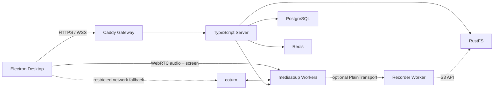

# 自建实时语音与桌面共享系统设计

**状态：** 已确认  
**日期：** 2026-07-15  
**核心决策：** 使用自建 mediasoup SFU 与 coturn，替换腾讯 TRTC、声网及其他托管 RTC 服务。

## 1. 目标与范围

首版交付一个面向中国大陆网络环境的实时语音房间应用：

- Windows 与 macOS Electron 客户端。
- 每个房间最多 20 名在线成员。
- 所有成员可以同时进行低延迟语音聊天。
- 每个房间同一时间只允许一个成员共享屏幕或应用窗口。
- 认证采用邮箱加密码；短信登录保留后续扩展位置。
- 桌面共享在认证硬件和合格网络下达到 1920x1080、60 fps。
- 共享者可以在共享过程中调节目标码率，不中断媒体连接。
- 服务端通过 Docker Compose 一键启动。
- 对象存储使用 RustFS，不使用 MinIO。
- 运行时信令、语音、屏幕媒体、STUN/TURN 和存储均位于自有服务器，不引用公共 STUN、境外 CDN、字体、脚本或遥测端点。
- 客户端协议与共享业务包保持平台无关，为后续移动端预留复用边界。
- 信令消息带显式协议版本，业务 schema 不包含 Electron 专属对象。

“不经过外部服务”指不依赖第三方实时音视频平台、直播 CDN 或外部对象存储。公网产品仍需要运营商或云主机带宽、域名和受信任 TLS 证书。若部署到中国大陆公网，域名、服务器和运营主体还需满足适用的备案及合规要求。

## 2. 首版不包含

- 多人同时共享屏幕。
- 摄像头视频会议。
- 服务端视频转码或合成布局。
- 强制端到端加密；首版使用标准 WebRTC DTLS-SRTP，媒体仅在自有 SFU 解密和转发。
- 桌面系统音频的跨平台一致支持。Windows 回环音频和 macOS 系统音频作为单独验证项，不能阻塞屏幕视频 MVP。
- 邮箱验证邮件、自动找回密码和短信发送。首版邮箱是账号标识，后续通过 SMTP 和短信适配器扩展。
- 录制作为首版验收项。架构预留录制 Worker 和 RustFS 输出，启用录制前必须增加用户提示、授权和审计。
- 公网多地域调度、跨地域级联 SFU 和自动扩缩容。

## 3. 方案选择

### 3.1 选择 mediasoup

mediasoup 是低层 WebRTC SFU，允许应用直接控制 Producer、Consumer、编码层和发送端 `RTCRtpSender`。它最符合“1080p60 且运行中精确调整码率上限”的硬约束，也不会引入托管媒体服务。

代价是房间信令、生命周期、权限、重连、TURN、监控和录制都需要自行实现。首版用模块化单体减少分布式协调成本，待出现多地域或多媒体节点需求时再拆分控制平面与媒体节点。

### 3.2 未选择的方案

- **LiveKit 自托管：** 部署和移动端 SDK 更完整，但当前需求把运行时码率精细控制放在首要位置；在 SDK 动态编码管理之外直接修改 sender 参数会增加兼容风险。
- **P2P Mesh：** 20 人房间中，8 Mbps 屏幕流需要共享者上传约 `8 x 19 = 152 Mbps`，不含语音和协议开销，无法作为稳定产品方案。
- **传统 RTMP 推流：** 延迟、双向语音、每订阅者自适应和 NAT 穿透能力不适合实时房间；本项目中的“推流”实际是 WebRTC 发布与 SFU 转发。

## 4. 总体架构



### 4.1 应用结构

采用 pnpm workspace：

```text
apps/
  desktop/            Electron + React 客户端
  server/             REST、WebSocket 信令、房间和 mediasoup Worker 管理
  load-test/          20 客户端媒体负载与故障注入
packages/
  protocol/           Zod 信令协议和共享类型
  config/             环境变量校验与共享配置
  database/           Drizzle schema、迁移和仓储
  observability/      日志、指标和追踪辅助
deploy/
  compose.yaml
  caddy/Caddyfile
  coturn/turnserver.conf
  rustfs/
```

首版 `apps/server` 是模块化单体。HTTP、WebSocket 和媒体编排在一个 Node.js 服务中，但 mediasoup 为每个 CPU Worker 启动独立原生子进程。每个房间只创建一个 Router 并固定到一个 Worker，按当前 Consumer 数选择负载最低的健康 Worker；Worker 失效时房间媒体全部重建，不把一个房间临时拆到多个 Worker。进程内只保存可重建的媒体对象；用户、房间和成员关系持久化到 PostgreSQL，跨实例租约和短期会话状态存入 Redis。

### 4.2 服务职责

| 组件 | 职责 |
|---|---|
| Caddy | HTTPS/WSS 终止、REST 和信令反向代理、安全响应头 |
| Server | 注册登录、令牌轮换、房间权限、信令、单路共享租约、mediasoup Worker/Router 生命周期 |
| mediasoup | 转发 Opus 音频和屏幕视频，不做转码 |
| coturn | ICE 直连失败时提供自建 TURN 中继 |
| PostgreSQL | 用户、会话、房间、成员、邀请和对象元数据 |
| Redis | 单路共享租约、在线状态、限流和多实例事件 |
| RustFS | 私有 S3 兼容对象存储；首版用于头像等对象，后续承接录制文件 |

## 5. 核心数据模型

### 5.1 PostgreSQL

- `users`: 稳定内部 `id`、`display_name`, `created_at`, `disabled_at`；邮箱或手机号均不作为用户主键。
- `auth_identities`: `user_id`, `provider`, `identifier_normalized`, `verified_at`；首版只启用 `email` provider。
- `password_credentials`: `user_id`, `password_hash`, `password_changed_at`；与登录标识分离，便于后续增加短信身份。
- `refresh_sessions`: 仅保存 refresh token 哈希、令牌族、到期时间、轮换和撤销状态。
- `rooms`: `id`, `name`, `owner_id`, `capacity`，首版 capacity 固定为 20 个同时在线媒体席位。
- `room_members`: 可持久化的房间成员及 `owner/member` 角色；成员总数不等于实时在线人数，可以超过 20。
- `room_invites`: 短期、可撤销的邀请代码。
- `objects`: RustFS bucket/key、内容类型、大小、所有者和用途；不保存公开永久 URL。

媒体 Transport、Producer、Consumer、音量、ICE 状态和当前码率不写 PostgreSQL。它们是连接级临时状态，连接断开后由客户端重新建立。

### 5.2 Redis

共享租约键为 `room:{roomId}:screen-share`，值包含 `userId`、`connectionId` 和随机 `leaseId`：

- 获取：`SET key value NX PX 15000`。
- 续租：共享者每 5 秒心跳；Lua 脚本仅允许相同 `leaseId` 延长 TTL。
- 释放：仅允许相同 `leaseId` 删除。
- 权威检查：即使 Redis 租约异常，Server 仍拒绝房间中的第二个 `screen` Producer。
- 连接丢失：关闭 Producer 并释放租约；最迟 15 秒自动过期。

## 6. 认证与授权

- 注册时规范化邮箱并在 identity 上建立 provider/identifier 唯一索引；密码使用 Argon2id 哈希。
- 登录返回短期 access token 和一次性轮换的 opaque refresh token。
- refresh token 仅以哈希形式保存；检测到已轮换令牌复用时撤销整个令牌族。
- HTTP 和 WSS 使用同一 access token 权限模型。
- 加入房间、创建 Producer、消费媒体、获取共享租约都进行服务端授权，客户端状态不作为权限依据。
- 首版不发送验证邮件，注册接口明确把邮箱作为未验证登录标识；产品上线开放注册前必须决定是否配置自建或允许的 SMTP。自动找回密码在未配置 SMTP 时不可用，由管理员执行受审计的账号恢复。后续 SMTP、短信验证码通过独立认证适配器接入，不修改媒体协议。
- TURN 凭证由服务端按用户和短过期时间动态签发，不在客户端内置长期静态密码。

## 7. 房间与媒体数据流

### 7.1 加入房间

1. 客户端通过 HTTPS 登录并取得 access token。
2. 客户端使用 token 建立 WSS，发送 `room.join`。
3. Server 校验成员身份和账号状态，并在 MediaRoom 中原子占用在线席位；已有 20 个有效 Peer 时拒绝第 21 个在线连接。
4. Server 返回 mediasoup Router RTP capabilities 和 ICE/TURN 配置。
5. 客户端加载设备能力，分别建立发送和接收 WebRtcTransport。
6. 客户端默认发布麦克风 Opus Producer；Server 为其他成员创建暂停状态的 Consumer，客户端确认就绪后恢复。

### 7.2 单路屏幕共享

1. 用户请求共享，客户端先调用 `screen.acquire`，不先启动发布。
2. Server 原子获取 Redis 租约并广播 `screen.ownerChanged`。
3. Electron 展示系统或应用内来源选择器，取得屏幕 MediaStreamTrack。
4. 客户端以 `source=screen` 创建两层编码的 Producer。
5. Server 二次校验租约、来源类型和房间内现有 Producer；校验失败立即关闭新 Producer。
6. 其他客户端订阅适合其带宽和视口的层。
7. 用户停止、轨道结束、连接断开或租约过期时，Server 关闭 Producer、释放租约并广播空闲状态。

### 7.3 断线恢复

- WSS 短断线后，客户端使用新的 access token 重连并重新加入房间。
- ICE `disconnected` 先进入短暂宽限；随后尝试 ICE restart；失败则销毁并重建 Transport。
- Server 或 mediasoup Worker 重启会终止现有媒体会话。客户端应退避重连、重新发布麦克风，并在原共享者仍持有业务资格时重新竞争共享租约。
- 房间成员和邀请保留，媒体对象不恢复旧 ID。

## 8. 音频设计

- Codec：Opus 48 kHz、单声道，启用 DTX、in-band FEC 和浏览器回声消除/噪声抑制/自动增益。
- 每名用户上传一个麦克风 Producer，订阅其余在线用户的音频 Consumer。
- 客户端提供麦克风选择、输出设备选择（平台支持时）、静音、耳机静音和说话状态。
- SFU 不进行混音；每个客户端本地播放远端轨道。
- 音量事件做节流并只用于界面指示，不持久化。

## 9. 1080p60 屏幕共享与码率

### 9.1 捕获

- Electron 使用 `desktopCapturer` 与 `getDisplayMedia` 获取屏幕或窗口。
- 请求理想约束 `1920x1080 @ 60 fps`，捕获后使用 `track.getSettings()` 验证实际分辨率和帧率。
- macOS 首次共享前检测并引导屏幕录制权限；授权变化后提示用户按系统要求重启应用。
- 不把 CSS 预览尺寸当作真实编码尺寸，质量判断以 WebRTC outbound stats 为准。
- 初始支持目标为 Windows 10 22H2/Windows 11 x64 与 macOS 13 及以上；最终最低版本随 PoC 采用的 Electron 版本冻结并写入发布清单。
- Retina/缩放屏幕、非 16:9 来源和小窗口保持原始宽高比，在编码边界内缩放，不拉伸。HDR 先按 SDR 采集；受保护内容、锁屏、UAC 安全桌面和平台拒绝捕获的窗口不在保证范围。

### 9.2 编码层

首版发布时创建固定的两层编码，运行中不增加或重排 RID：

| RID | 目标 | 初始最大码率 |
|---|---|---:|
| `q` | 1280x720、最高 30 fps | 2.0 Mbps |
| `f` | 1920x1080、最高 60 fps | 8.0 Mbps |

编码优先级通过 Windows/macOS 硬件矩阵 PoC 后锁定。首选 VP8 simulcast 以获得稳定的分层控制；若认证设备上的 H.264 硬件编码在 1080p60 和多层发布上表现更好，则将 H.264 作为首选并保留 VP8 回退。SFU 不转码，因此所有接收端必须支持最终选择的 codec。

### 9.3 码率调节

- UI 提供自动、2、4、6、8 Mbps 预设和 1-10 Mbps 高级滑块。
- 调节作用于高清层 `RTCRtpSender.getParameters()` 中现有 encoding 的 `maxBitrate`，再调用 `setParameters()`；不重新协商，不停止共享。
- Server 对发送 Transport 设置允许的最高接收码率，防止客户端绕过产品上限。
- 所有 UI 文案都标为“目标码率”。拥塞控制、丢包和编码器能力可以使实际码率低于目标。
- 接收端依据可用带宽、窗口可见性和渲染尺寸选择 720p 或 1080p 层；隐藏或最小化时暂停视频 Consumer，音频不受影响。

## 10. 网络与容量

### 10.1 单房间估算

8 Mbps 高清层向另外 19 人转发时，仅屏幕视频出口约为 `152 Mbps`。再加：

- 20 人语音全订阅约 380 个音频 Consumer。
- 720p 备用编码上传和可能的低层订阅。
- RTP/RTCP、DTLS、SRTP、NACK/RTX 和重传开销。
- TURN 中继造成的额外入站与出站流量。

单个满员房间按 `200-300 Mbps` 峰值出口预算。首个生产节点最低建议 8 vCPU、16 GB RAM、1 Gbps 公网网卡和适合中国大陆用户的多线/BGP 网络；正式容量必须以 20 客户端负载测试数据为准，而不是仅按公式承诺。

### 10.2 端口与主机网络

- `80/tcp`, `443/tcp`: Caddy 和 WSS。
- 每个 mediasoup Worker 一个固定 UDP 端口，并提供同端口 TCP 回退；绑定 `0.0.0.0` 时配置公网 `announcedAddress`。
- `3478/udp,tcp`, `5349/tcp`: coturn；TURN relay 使用受控 UDP 端口段。
- coturn 在 Linux 生产主机使用 host network，避免 Docker 对大 UDP 端口段的转发开销。
- 如要求 TURN/TLS 必须走 `443/tcp`，应给 coturn 配置独立公网 IP；不能与同一 IP 上的 Caddy 直接争用端口。
- PostgreSQL、Redis、RustFS API 和管理控制台默认只在 Compose 内网可达。

## 11. Docker Compose 部署

生产服务器目标为 Linux。管理员填写 `.env.production` 后执行：

```bash
docker compose --env-file .env.production -f deploy/compose.yaml up -d
```

Compose 包含：

- `gateway`
- `server`
- `postgres`
- `redis`
- `rustfs`
- `coturn`
- 可选 `recorder` 和 `observability` profiles

部署前置检查必须验证公网 IP、域名解析、TLS 文件或 ACME 配置、UDP 端口、数据目录权限、磁盘空间、弱口令和必填密钥。所有有状态服务挂载持久卷并提供健康检查。数据库迁移作为一次性 Compose job，在 server 启动前完成。

RustFS 使用私有 bucket、独立访问密钥和 path-style S3 客户端配置，并通过契约测试覆盖普通上传、分片上传、重试、签名 URL 和生命周期规则。单节点单盘模式只适合开发或小规模试运行；生产数据需备份，重要录制数据应采用多盘或多节点策略。

## 12. 安全与隐私

- 全部公网 HTTP/WSS 使用 TLS；媒体使用 WebRTC DTLS-SRTP。
- Electron 启用 `contextIsolation`、sandbox、严格 CSP，禁用 renderer 的 Node.js integration，仅暴露最小 preload API。
- 密码、refresh token、TURN secret 和 RustFS secret 不写日志。
- RustFS bucket 不公开；下载采用短期签名 URL 或 Server 代理授权。
- 邀请、登录、共享租约和信令操作执行用户/IP 双维度限流。
- 房间服务端强制容量、成员权限和单路共享，不信任客户端声明。
- 审计登录失败、成员管理和录制控制；不记录媒体内容和 SDP 中不必要的敏感信息。

## 13. 可观测性

- JSON 结构化日志包含 requestId、roomId、connectionId 和匿名化 userId。
- 健康检查区分 liveness 与 readiness；PostgreSQL、Redis、RustFS 和 mediasoup Worker 状态进入 readiness。
- 部署验收增加真实 ICE/媒体探针，不能仅以容器进程存活作为媒体服务健康依据。
- 采集房间人数、Producer/Consumer 数、Worker CPU、进出字节、ICE 类型、TURN 比例和重连次数。
- 客户端每 5 秒采样一次 WebRTC stats，展示诊断面板并按分钟聚合上报：实际码率、编码尺寸、fps、RTT、丢包、NACK、PLI、quality limitation reason。
- 默认不上传屏幕标题、窗口名称或画面内容。

## 14. 错误处理

| 场景 | 行为 |
|---|---|
| 房间已满 | 返回稳定错误码 `ROOM_FULL`，客户端保留在房间列表页 |
| 已有共享者 | 返回 `SCREEN_SHARE_BUSY` 并显示当前共享者 |
| 用户取消系统来源选择 | 释放刚获取的租约，不显示故障提示 |
| 捕获未达到 1080p60 | 继续共享，显示实际质量和受限原因 |
| `setParameters` 被平台拒绝 | 回滚到上一个有效预设并上报诊断事件 |
| UDP 不通 | ICE 尝试 TCP，再回落到自建 TURN |
| Redis 暂时不可用 | 禁止新建共享，保持已有媒体；恢复后依据实际 Producer 重建租约 |
| mediasoup Worker 崩溃 | 关闭其房间状态、标记节点不就绪、客户端退避重连 |
| RustFS 不可用 | 不影响实时语音和共享；对象上传返回可重试错误 |

## 15. 验收标准

### 15.1 功能

- 用户可用邮箱和密码注册、登录、刷新会话和退出。
- 用户可创建房间、通过邀请加入并看到在线成员。
- 第 21 名用户被服务端拒绝进入同一房间。
- 20 人可同时语音，静音、设备切换和说话状态正常。
- 每个房间只能存在一个屏幕 Producer；并发竞争最多一个成功。
- 共享者可选择屏幕或窗口，可在共享中调节目标码率，无需重新发布。
- 客户端重连后恢复房间和语音；失效的共享租约在 15 秒内清理。
- 所有运行时媒体、信令、TURN 和对象请求都指向自有域名/IP。

### 15.2 1080p60 认证条件

在发布端上行至少 20 Mbps、接收端下行至少 12 Mbps、RTT 不高于 80 ms、丢包不高于 0.5% 的受控网络中：

- 认证 Windows 与 macOS 设备的捕获、发送编码和接收解码分辨率均为 1920x1080。
- 使用持续动态桌面素材测试；连续 10 分钟内，发送端和接收端至少 95% 的有效采样不低于 55 fps，且不发生持续黑屏、冻结或媒体断开。
- 8 Mbps 预设稳定后，实际发送码率在无拥塞时落入目标的合理容差范围；质量限制原因不是 CPU 或 bandwidth。
- 2/4/6/8 Mbps 切换在 5 秒内稳定，不重新创建 Producer。

认证设备矩阵至少包括 Windows 上的 Intel 核显、AMD 或 NVIDIA 独显，以及 macOS 的 Apple Silicon；Intel Mac 是否列入保证范围由 PoC 结果决定。

### 15.3 稳定性与故障

- 20 客户端、全语音、单路 1080p60 共享持续 2 小时，不出现进程崩溃或无法恢复的媒体中断。
- 完成直连 UDP、WebRTC TCP 和强制 TURN 三种路径测试。
- 覆盖 3% 丢包、100-200 ms RTT、带宽突降和恢复，验证降层、码率恢复和音频连续性。
- 重启 Server、断开 Redis、阻断 UDP 和切换网络时，客户端给出可理解状态并按设计恢复。
- 记录满房间 CPU、内存、入站/出站带宽和 TURN 占比，形成单节点容量基线。

## 16. 测试策略

- **单元测试：** 邮箱规范化、密码策略、token 轮换、房间容量、权限、共享租约 Lua、信令状态机、码率参数变换。
- **集成测试：** 使用真实 PostgreSQL、Redis、RustFS 和 mediasoup Worker，验证迁移、会话、房间和媒体生命周期。
- **契约测试：** protocol package 中每个 WSS 请求、成功响应、错误和广播均由 Zod schema 覆盖。
- **端到端测试：** Electron 启动、注册登录、加入房间、麦克风权限、来源选择、共享启停和码率控制。
- **媒体负载测试：** Chromium 合成音频与 canvas 60 fps 视频，建立 20 个客户端并采集 stats。
- **平台测试：** 在真实 Windows/macOS 硬件上检查权限、硬件编码器、显示器缩放、多显示器、窗口最小化和睡眠唤醒。
- **安全测试：** 重放 refresh token、伪造房间成员、并发共享竞争、长期 TURN 凭证、RustFS 越权和 Electron preload 越权。

## 17. 分阶段交付

1. **阻断性技术 PoC：** 依次验证两平台 1080p60/codec 硬件矩阵与动态码率、1+19 满房负载、TURN/公网部署；三项未通过前不进入完整产品开发。
2. **核心 MVP：** 邮箱密码、房间、20 人语音、单路桌面共享、码率预设、重连。
3. **可部署版本：** Compose、RustFS、监控、安全加固、备份和故障演练。
4. **桌面发布：** Windows 签名安装包、macOS 签名/公证、自动更新策略。
5. **后续扩展：** 移动端、短信登录、系统音频、录制、多地域媒体节点。

## 18. 参考资料

- [mediasoup v3 documentation](https://mediasoup.org/documentation/v3/)
- [mediasoup WebRtcServer API](https://mediasoup.org/documentation/v3/mediasoup/api/)
- [Electron desktopCapturer](https://www.electronjs.org/docs/latest/api/desktop-capturer/)
- [RTCRtpSender.setParameters](https://developer.mozilla.org/en-US/docs/Web/API/RTCRtpSender/setParameters)
- [coturn Docker deployment](https://github.com/coturn/coturn/blob/master/docker/coturn/README.md)
- [RustFS Docker installation](https://docs.rustfs.com/installation/docker/)
- [RustFS S3 compatibility](https://docs.rustfs.com/features/s3-compatibility/)
