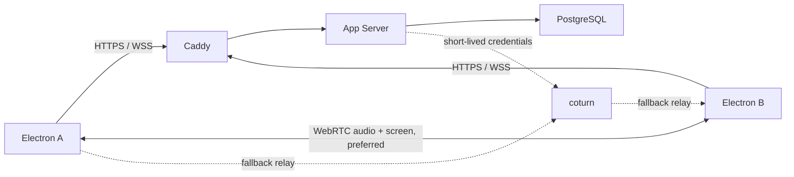

# 两人实时语音与单路桌面共享 MVP 设计

**状态：** 已确认  
**日期：** 2026-07-16  
**适用版本：** 首个可用版本  
**核心决策：** 首版固定为两人临时房间，使用 P2P WebRTC；媒体优先直连，失败时仅通过自建 coturn 中继。

## 1. 背景与决策

原方案面向最多 20 人的语音房间，使用自建 mediasoup SFU，并把 20 人容量、1080p60 严格认证、RustFS 和生产部署作为连续阻断门禁。当前产品目标已收敛为两人之间的语音和单路桌面共享，因此首版不再承担多人容量和对象存储需求。

本设计取代 `2026-07-15-self-hosted-rtc-design.md` 作为当前 MVP 的产品与实现依据。原设计和 mediasoup 实验保留为历史证据及未来多人版本参考，不删除、不改写实验结论。

选择 P2P WebRTC 的原因：

- 两人场景只需要一条点对点媒体连接，不需要 SFU 复制媒体流。
- 媒体直连时延迟和服务端带宽成本更低。
- 直连失败时使用部署方自己的 coturn，仍不依赖任何外部 RTC、STUN 或 TURN 服务。
- `RTCRtpSender.setParameters()` 仍可在通话中调整屏幕视频目标码率。
- 现有 H.264、捕获、硬件编码、统计和码率控制实验成果可继续用于客户端。

代价是未来扩展到三人及以上时需要重新引入 SFU。该代价被明确接受，不为尚未进入首版的多人需求增加当前复杂度。

## 2. 首版范围

首版必须交付：

- Windows 与 macOS Electron 客户端。
- 邮箱加密码注册和登录；首版不发送验证邮件。
- 登录用户创建临时房间并获得 6 位数字房间码。
- 第二名登录用户输入房间码加入；房间最多绑定两个不同账号。
- 两人双向低延迟语音。
- 任意一方可以共享桌面或应用窗口，但同一时刻只允许一路共享。
- 共享过程中可选择自动、2、4、6、8 Mbps 目标码率，不中断语音或重建整条连接。
- 最高质量档请求 1920x1080、60 fps，并显示实际捕获和发送质量。
- 服务端通过 Docker Compose 一条命令启动。
- 所有认证、信令、STUN/TURN 和可能的媒体中继都由部署方自己的服务提供。
- 协议与媒体控制模块保持平台无关，为后续移动客户端复用。

首版明确不包含：

- 三人及以上房间、联系人、好友、直接呼叫或响铃。
- 长期房间、房间列表和持久化成员关系。
- 摄像头、文字聊天、文件传输、头像、录制和直播分发。
- 桌面系统声音共享。
- 短信登录、邮箱验证邮件和自动找回密码。
- RustFS、Redis、mediasoup、多实例服务端和自动扩缩容。
- 移动端客户端；仅保留可复用协议边界。

RustFS 在没有头像、文件或录制对象时没有运行职责，因此不进入本版 Compose。后续出现对象数据后再按原定选择接入 RustFS，不使用 MinIO。

## 3. 总体架构



### 3.1 组件职责

| 组件 | 职责 |
|---|---|
| Electron | 登录、房间操作、设备权限、麦克风、桌面捕获、WebRTC、码率控制和质量显示 |
| Caddy | HTTPS/WSS 终止、反向代理和安全响应头 |
| App Server | 认证、临时房间、连接授权、WebRTC 信令、单路共享所有权和 TURN 临时凭证 |
| PostgreSQL | 用户、密码凭据和 refresh session |
| coturn | 自建 STUN/TURN；仅在端到端直连失败时中继加密媒体 |

App Server 首版只运行一个实例。临时房间和在线连接保存在进程内；服务重启会使临时房间失效。用户和登录会话持久化，不受临时房间清理影响。

### 3.2 媒体连接

每个两人房间建立一个 `RTCPeerConnection`。创建者是初始 offer 方，加入者是 answer 方，双方通过授权后的 WSS 交换 SDP 和 trickle ICE candidate。

初始协商同时准备：

- 一个双向 Opus 音频通道；
- 一个双向屏幕视频通道，开始时没有发送轨道。

共享开始时把捕获轨道放入已经协商的视频 sender；停止时替换为空轨道。这样开始和停止共享不需要重新创建 `RTCPeerConnection`，也不会中断语音。ICE restart 仍可在网络切换或连接失败时触发。

## 4. 用户流程

### 4.1 注册与登录

1. 用户输入邮箱、密码和显示名称注册。
2. 服务端规范化邮箱、哈希密码并建立账号。
3. 登录返回短期 access token 和轮换式 opaque refresh token。
4. access token 保存在渲染进程内存；refresh token 通过 Electron 主进程写入操作系统安全存储。

### 4.2 创建和加入房间

1. 登录用户点击“创建房间”。
2. 服务端用密码学安全随机数生成 6 位数字码，10 分钟内有效。
3. 创建者进入等待状态并把房间码发给另一人。
4. 第二名登录用户输入房间码加入。
5. 加入成功后邀请码立即停止接受新账号，房间绑定两个 user ID。
6. 第三名用户、重复的其他账号或过期房间码均被拒绝。

房间不写入长期列表。只要其中一人仍在线，已绑定的另一账号可以自动重连。双方都断开后保留 2 分钟宽限，仍未恢复则销毁临时房间。创建者主动结束房间时立即销毁。

### 4.3 通话

1. 第二人加入后，创建者发起 WebRTC 协商。
2. 双方发布麦克风并播放远端 Opus 音频。
3. 用户可以静音、切换麦克风和切换输出设备（平台支持时）。
4. 一方离线时，另一方看到明确状态；宽限期内自动恢复信令和媒体。
5. 双方离开或创建者结束后关闭轨道、连接和房间状态。

### 4.4 桌面共享

1. 用户先向 App Server 获取共享权，再打开系统屏幕或窗口选择器。
2. 取消选择会立即释放共享权。
3. 捕获成功后将轨道放入预协商的视频 sender，并开始每 5 秒续约共享权。
4. 另一方收到远端视频轨道并显示共享舞台。
5. 当前共享者可以在自动、2、4、6、8 Mbps 之间切换目标上限。
6. 用户停止、捕获轨道结束、连接断开或 15 秒未续约时，服务端释放共享权。
7. 共享空闲后，任意一方都可以发起新的共享。

服务端共享权是业务授权；即使客户端界面状态错误，也不能让两人同时被认定为共享者。

## 5. 媒体策略

### 5.1 语音

- Codec 使用 Opus 48 kHz 单声道。
- 请求 echo cancellation、noise suppression 和 auto gain control。
- 启用 DTX 和 in-band FEC；最终参数以双方实际协商结果为准。
- 静音优先切换轨道 enabled 状态，不重复采集或重新协商。
- 切换麦克风使用 `replaceTrack()`，不重建连接。

### 5.2 屏幕视频

- 请求理想约束 1920x1080、60 fps，保持来源宽高比，不拉伸。
- Windows 默认候选为 H.264 单层编码；macOS codec 必须依据真实设备测试确认。
- P2P 不做服务端转码、合成或多层选择。
- 自动码率交给 WebRTC 拥塞控制；固定档位通过 sender encoding 的 `maxBitrate` 设置上限。
- 码率值是目标上限，不承诺静态画面必然产生对应实际流量。
- 调整码率失败时恢复上一次成功值并显示错误，不中断共享。

客户端必须分别展示：

- 捕获轨道实际宽度、高度和帧率；
- WebRTC 实际发送码率和发送帧率；
- 接收端实际解码或呈现帧率；
- 当前连接使用直连还是 TURN relay。

1080p60 仍是明确质量要求，不被降级为 1080p30。开发顺序允许先完成两人核心流程，再在两台真实设备上完成 1080p60 质量认证；未通过认证前不能宣称该平台已稳定支持 1080p60。

## 6. 信令与状态

继续使用版本化、Zod 校验的消息 envelope。首版信令至少包含：

- `room.create`、`room.join`、`room.resume`、`room.leave`、`room.end`；
- `peer.ready`、`peer.left`；
- `webrtc.offer`、`webrtc.answer`、`webrtc.answerApplied`、`webrtc.iceCandidate`、`webrtc.iceRestart`；
- `screen.acquire`、`screen.renew`、`screen.release`、`screen.ownerChanged`；
- `screen.bitrate`，用于授权校验、限值和诊断，不代替客户端 sender 参数更新。

每个信令请求带 request ID，服务端对重复请求返回幂等结果。服务端从 access token 和 socket 会话取得 user ID、connection ID，不接受客户端在负载中声明身份。

临时房间状态机：

```text
WAITING -> NEGOTIATING -> CONNECTED -> RECONNECTING -> CONNECTED
   |             |             |             |
   +-------------+-------------+-------------+-> CLOSED
```

共享状态机：

```text
IDLE -> ACQUIRED -> CAPTURING -> SHARING -> STOPPING -> IDLE
                    |              |
                    +----error-----+
```

状态转换必须可重复清理，避免重复释放、断线和轨道结束同时发生时遗留共享权。

## 7. 安全与隐私

- 密码使用 Argon2id，数据库不保存明文密码。
- refresh token 仅保存哈希，轮换后再次使用会撤销对应 token family。
- HTTP 和 WSS 使用同一 access token 授权模型。
- TURN 用户名和密码按账号、房间及短过期时间动态生成，不在客户端内置长期凭据。
- 只下发自建 STUN/TURN 地址，不使用公共 Google STUN 或托管 RTC 服务。
- 房间码按用户和 IP 限速；创建和加入接口设置全局上限，降低 6 位数字码枚举风险。
- 日志不记录密码、token、房间码、SDP、ICE 私网地址、邮箱全文或窗口标题。
- Electron 启用 context isolation 和 sandbox，禁用 node integration，并使用严格 preload IPC 白名单。
- 麦克风和桌面轨道只进入 WebRTC，不上传到 App Server 或对象存储。

## 8. 异常与恢复

客户端为以下情况提供明确、可恢复的状态：

| 情况 | 行为 |
|---|---|
| 房间码错误或过期 | 留在加入页，允许重新输入，不泄露房间存在细节 |
| 房间已绑定两人 | 返回房间已满，不建立信令会话 |
| 对方暂时离线 | 保留本地设备状态，进入重连等待 |
| 麦克风权限拒绝 | 允许留在房间并重新授权，不发布空白伪轨道 |
| 屏幕权限拒绝或取消 | 释放共享权，语音继续 |
| 共享已占用 | 不打开捕获选择器，显示当前不可共享 |
| 直连失败 | 自动尝试自建 TURN；成功后标记 relay |
| 码率更新失败 | 回滚上一次目标值，语音和共享继续 |
| 网络切换 | 尝试 ICE restart；失败后在宽限内重建连接 |
| App Server 重启 | 当前临时房间失效，提示重新创建房间 |

## 9. Docker 部署

首版 `compose.yaml` 包含：

- `caddy`
- `server`
- `postgres`
- `coturn`

部署流程：

```bash
cp .env.example .env
docker compose up -d
```

启动时执行配置校验和数据库迁移；缺失生产密钥、域名、数据库密码、TURN shared secret 或公网地址时拒绝启动。所有容器提供 healthcheck，PostgreSQL 不暴露公网端口。

公网至少需要：

- `80/tcp`、`443/tcp`：HTTPS/WSS 和证书签发；
- `3478/udp`、`3478/tcp`：TURN；
- 一段固定 UDP relay 端口范围，默认值在部署文档中给出并允许修改。

Caddy 支持自动申请证书，也允许部署方提供现有证书。中国大陆公网部署仍需根据服务器、域名和运营主体处理适用的备案及合规要求。

Docker Compose 只部署服务端。Windows 和 macOS Electron 安装包通过独立构建和签名流程产出。

## 10. 验证与验收

### 10.1 自动化验证

- 认证、token 轮换、房间码限速和双人容量测试。
- 临时房间状态机、断线宽限和重复请求幂等测试。
- offer/answer/ICE 信令授权测试。
- 单路共享竞争、续约、释放和超时测试。
- sender 码率设置、失败回滚和不触发重新协商测试。
- Electron 安全边界、权限错误和 UI 状态测试。
- Compose 配置、健康检查和数据库迁移测试。

### 10.2 两台真实设备验收

至少覆盖 Windows-Windows 和 Windows-macOS：

- 注册、登录、创建、输入房间码和第三人拒绝。
- 双向语音、静音、设备切换和离开清理。
- 任意一方开始、停止和交换共享权。
- 自动及 2、4、6、8 Mbps 档位切换不打断语音或视频连接。
- 直连路径和强制 TURN relay 路径。
- 短暂断网及网络切换后的恢复。
- 屏幕权限拒绝、轨道被系统终止和应用退出。

### 10.3 1080p60 质量认证

使用具有持续动态画面的可重复测试源，在两台独立物理设备上分别记录捕获、编码、网络、解码和呈现统计。认证必须同时证明：

- 实际捕获和发送分辨率为 1920x1080；
- 发送端编码与接收端实际呈现持续接近 60 fps；
- 运行中切换目标码率不重建连接；
- 语音在屏幕共享和码率切换期间保持连续；
- 测试明确记录硬件、操作系统、Electron 版本、codec、直连或 relay 路径以及限制条件。

现有 Windows 同机严格预检的接收端呈现门禁失败，不能作为通过证据。新 MVP 可以复用其测试工具，但最终结论必须来自两台独立设备；macOS 也必须单独认证。

## 11. 现有成果复用

可直接保留或提取：

- `packages/protocol` 的版本化 envelope、媒体类型、错误和共享租约消息；
- `packages/config` 的环境配置校验模式；
- `packages/media-policy` 的单层屏幕编码、码率和统计逻辑；
- media lab 的桌面捕获、H.264 候选、硬件编码证据、动态码率和质量采样工具；
- Electron 安全边界与后续跨平台测试结论。

需要替换：

- 产品媒体路径不再使用 mediasoup Router、Transport、Producer 和 Consumer；
- 原来的 20 人容量门禁、Worker 池、Redis 共享租约和 RustFS 集成不进入当前 Task 主线；
- 原实施计划 Tasks 4-19 不再按原顺序执行，改为新的两人 MVP Task 清单。

## 12. 完成定义

当且仅当以下条件全部满足，才称为两人 MVP 完成：

- 两个邮箱密码账号可以通过一次性房间码建立通话。
- 双向语音与单路桌面共享在直连和自建 TURN 路径均可工作。
- 任意一方能取得共享权并动态修改目标码率。
- 服务端可以用文档化的一条 Docker Compose 命令部署。
- Windows 和 macOS 客户端可构建，并完成可获得设备范围内的真实设备证据；未验证项目被明确标记，不作虚假承诺。
- 自动化测试、配置校验和安全检查通过。
